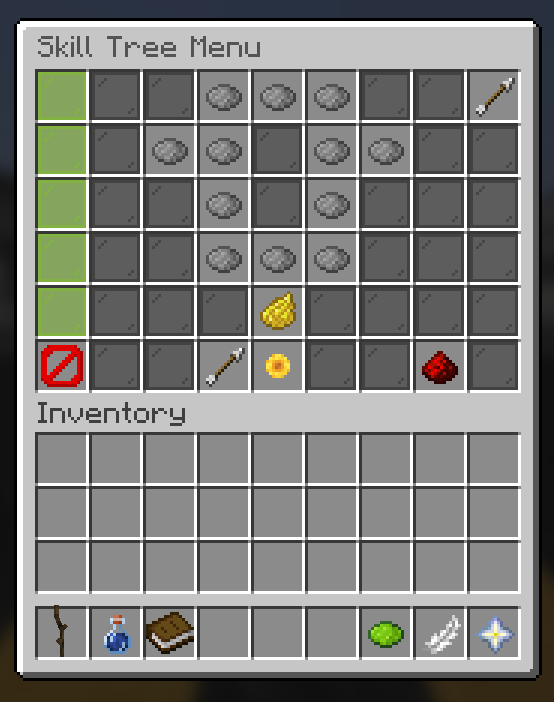
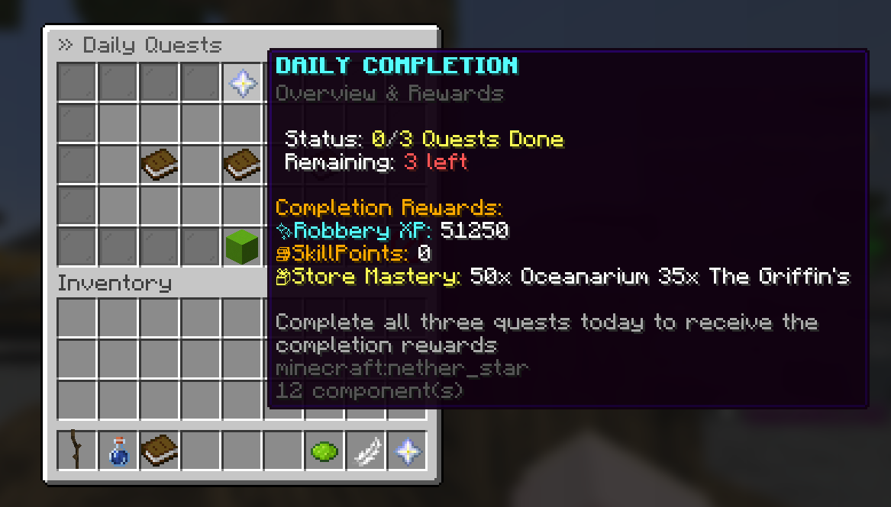
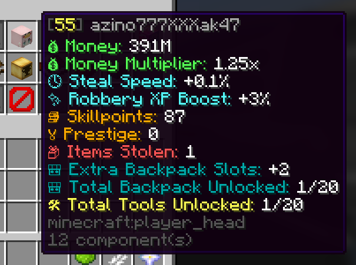
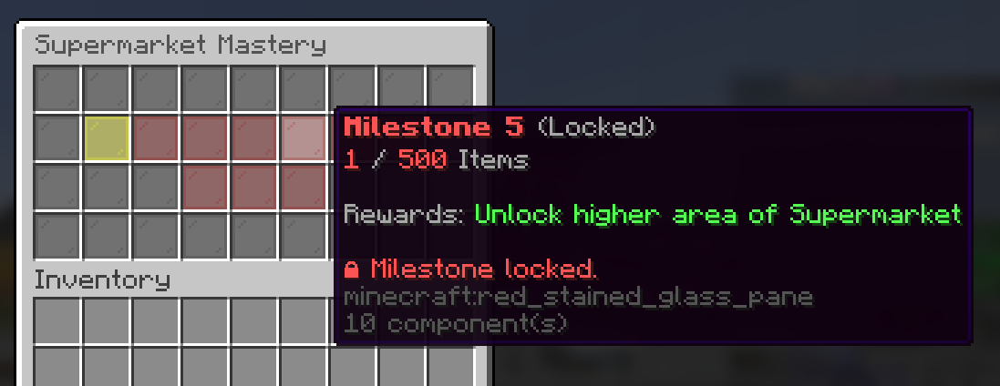

<div align="center">

# 💎 MeSuMi - Robbery
### *Robbery Plugin for Minecraft 1.21.4*
### *Inspired on an old Robbery game*


---

**Developed with precision by the MeSuMi Team.**  
*We operate as an independent team, created a plugin exclusively for the MeSuMi Minecraft Server.*

</div>

---

## 🚨 Legal Notice & Intellectual Property Warning

> [!CAUTION]
> **PROPRIETARY & PROTECTED CODEBASE — ALL RIGHTS RESERVED**  
> This repository, including all source code (`Java`), configuration schemas (`YAML`), custom assets, and compiled binaries (`.jar`), is the exclusive property of the **MeSuMi Team**.  
> **Unauthorized usage is strictly prohibited.** You may **NOT** download, install, host, decompile, duplicate, or monetize this plugin on any external server, network, or commercial project without written authorization. See the [LICENSE](file:///c:/Users/ppava/IdeaProjects/MeSuMi/LICENSE) file for complete legal terms.

---

## 🎮 About The Project

**MeSuMi - Robbery** from an old inspiration gamemode (Robbery), we decided to re-create that same gamemode with new twists. 

Engineered for **PaperMC 1.21.4**, the plugin combines custom stealing mechanics, outposts, expandable private vaults, custom skill trees, and integrated server moderation.

---

## ✨ Core Game Mechanics

To keep our documentation user-friendly and easy to navigate, explore each system by clicking the sections below:

<details>
<summary><b>🗡️ Rank Hierarchy & Prestige System</b> <i>(Click to expand)</i></summary>
<br>

Players progress through **7 distinct ranks**, each unlocking new perks, commands and more:
1. **Burglar** (`robbery.rank1`)
2. **Robber** (`robbery.rank2`)
3. **Bandit** (`robbery.rank3`)
4. **Outlaw** (`robbery.rank4`)
5. **Heister** (`robbery.rank5`)
6. **Kingpin** (`robbery.rank6`)
7. **Mafia Boss** (`robbery.rank7`)

#### 🔥 Prestige System (`/prestige`)
Prestiging resets all money and stores/keys in exchange for money multiplier, and unlocks new stores.
</details>

<details>
<summary><b>🧠 Skill Tree & Mastery Perks</b> <i>(Click to expand)</i></summary>
<br>

Robbery features a fully interactive GUI Skill Tree (`/skillpoints`):
- **Earn Skill Points**: Level up your Robbery Level by stealing items, daily quests, and opening crates.
- **Custom Perk Branches**: Spend skill points on passive upgrades (money multiplier, steal speed, special abilities).
- **Store Mastery (`Store Mastery 5`)**: Master your store operations to unlock new areas in each store. For example, accessing **The Vault** requires **Store Mastery 5** AND **Prestige 3** (`9e8f764`).
- **Reset Tokens (`/resetskilltree`)**: Players can reset their skill tree if they obtain a rare reset skill tree token.
</details>

<details>
<summary><b>💰 Outposts, Stealing & Custom Economy</b> <i>(Click to expand)</i></summary>
<br>

- **Outpost Control (`/outpost`)**: Hideouts can battle over outposts. Controlling an outpost grants passive rewards. (`/outpostinfo`).
- **Robbery & Buybacks**: Steal using tools (`/buytool`) and buy keys (`/buykey`). If caught while stealing you get busted (`/busted`), you can upgrade your backpack and other in the mall. (`/buyback`).
- **Dynamic Boosters (`/boosters`)**: Activate personal XP/economy boosters (`/usebooster`, `/stopbooster`) to accelerate your grind.
</details>

<details>
<summary><b>🎒 Private Vaults (Backpacks) & Custom Items</b> <i>(Click to expand)</i></summary>
<br>

- **Private Vaults (`/pv [slot]`)**: Portable virtual chest storage (`backpacks`) more can be obtained with higher rank.
- **Custom Items (`/additem`)**: Moderator command to create an item and place it inside Minecraft, keys and crates (`/rcrate`).
</details>

<details>
<summary><b>📜 Daily Quests & Community Integration</b> <i>(Click to expand)</i></summary>
<br>

- **Daily Quests (`/quests`)**: Fresh daily objectives ranging from outpost to stealing items.
- **Weekly Leaderboards (`/weeklyleaderboard`) & Baltop (`/baltop`)**: Compete every week for top server rankings and exclusive rewards.
- **Voting Rewards Integration (`/votes`)**: Fully integrated with `VotingPlugin` to reward voting for our server.
</details>

---

## 📸 Gallery & Gameplay Showcase

> [!TIP]
> **How to add screenshots or videos to your GitHub README**:
> 1. Take screenshots of your `/skillpoints` tree, `/ranks` GUI, or record a short video/GIF of a server heist.
> 2. Upload the images inside a `docs/images/` folder inside this repository.
> 3. Replace the placeholder links below with the relative path (``).

|          👑 The Skill Tree (`/skillpoints`)          |                            🏛️ Daily Quests                             |
|:----------------------------------------------------:|:-----------------------------------------------------------------------:|
|  **  |             **             |
| **Interactive GUI featuring our skill tree system.** | **Daily Quests system, you might need to find the Quest Master first.** |

|                🎒 Player Stats                |          📊 Mastery/Store Milestones          |
|:---------------------------------------------:|:---------------------------------------------:|
| ** | ** |
|   **You can see your in game statistics.**    |  **Mastery and milestones for each store.**   |

### 🎥 Video Gameplay Preview
```markdown
Coming Soon
```

---

## 🛠️ Command Reference

### 👤 Player Commands
| Command | Description                                                 | Permission |
| :--- |:------------------------------------------------------------| :--- |
| `/robbery` | To join robbery server                                      | `robbery.default` |
| `/ranks` / `/rankup` | View all the ranks in the server and rank up to a new store | `robbery.default` |
| `/prestige` | Ascend to the next Prestige tier                            | `robbery.default` |
| `/skillpoints` | Open the Skill Tree menu                                    | `robbery.default` |
| `/pv [slot]` | Open your personal vault                                    | `robbery.default` |
| `/outpost` / `/outpostinfo` | Teleport to or inspect outpost rewards                      | `robbery.default` |
| `/quests` | Open your daily quests dashboard                            | `robbery.default` |
| `/boosters` | View your boosters                                          | `robbery.default` |
| `/baltop [page]` | Display top server balances                                 | `robbery.default` |
| `/weeklyleaderboard` | View weekly top hideouts                                    | `robbery.default` |
| `/l` / `/lobby` / `/s` / `/spawn` | Teleport to server lobby or spawn                           | `robbery.default` |
| `/store` / `/mall` | Teleport to current store, teleport to the mall             | `robbery.mall` |
| `/chatcolor` | Customize your chat message colors                          | `robbery.default` |

### 🛡️ Admin & Staff Commands
| Command | Description                                        | Permission |
| :--- |:---------------------------------------------------| :--- |
| `/adminxp <give\|set\|reset\|setlevel>` | Modify a player's Robbery XP or Level directly     | `robbery.adminxp` |
| `/additem <item_name>` / `/removeitem` | Spawn or delete custom items                       | `robbery.op` |
| `/buykey` / `/buytool` / `/buyback` | Admin spawn/grant of custom keys and tools         | `robbery.op` |
| `/resetskilltree <player>` | Reset a player's skill tree and refund points      | `robbery.op` |
| `/usebooster` / `/stopbooster` | Grant or toggle server/player boosters             | `robbery.op` |
| `/rankupdate <rank> [player]` | Force set a player's rank                          | `robbery.op` |
| `/rcrate <item> <qty> <player>` | Give Robbery crates to a player                    | `robbery.op` |
| `/warn` / `/warnings` | Issue a moderation warning or view warning history | `robbery.op` |
| `/mute` / `/unmute` / `/muteinfo` | Mute a player or inspect current mutes             | `robbery.staff` |
| `/robbery reload` | Reload `plugin.yml`, `language.yml`, and configs   | `robbery.op` |

---

## 💻 Build & Server Setup Guide

### Prerequisites
- **JDK 21 or newer** (Required for PaperMC 1.21.4 compatibility).
- **PaperMC 1.21.4** server instance.
- Required Soft/Hard Dependencies: `Vault`, `PlaceholderAPI`, `ProtocolLib`, `VotingPlugin`, `SuperiorSkyblockAPI`, `LuckPerms`.

### Building with Gradle
To compile the plugin `.jar` locally on your system:
```powershell
# Run the Gradle build task
./gradlew build
```
Once compilation completes, the ready-to-deploy artifact will be located at:
```text
build/libs/MeSuMi-Robbery-1.0-1.21.4.jar
```

### Installation
1. Copy `build/libs/MeSuMi-Robbery-1.0-1.21.4.jar` into your PaperMC server's `plugins/` directory.
2. Ensure `Vault.jar` and an economy provider (like EssentialsX or custom core) are installed.
3. Restart your server or run `/robbery reload`.

---

<div align="center">
<p><b>Crafted with ❤️ by the MeSuMi Team for the MeSuMi Server Community.</b></p>
<p><i>All Rights Reserved © 2026 MeSuMi Team.</i></p>
</div>
